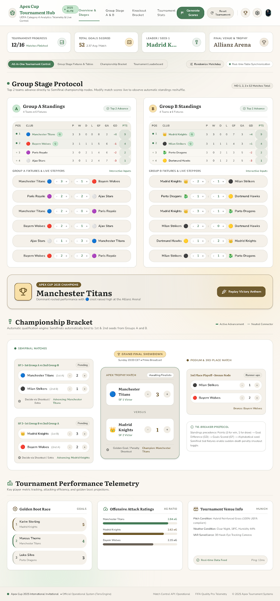

# ⚽ Copa Meinha de Botão

Sistema completo de gerenciamento de torneios de futebol de botão (mesas oficiais, regras 12 toques & dadinho) desenvolvido sob o design system **Terra — Organic Design**.



## 🌟 Recursos

- **Fase de Grupos Interativa**: Tabelas dos Grupos A e B com classificação em tempo real (Pontos, Vitórias, Empates, Derrotas, Gols Pró, Contra e Saldo).
- **Mata-Mata Automático**: Semifinais (1ºA x 2ºB e 1ºB x 2ºA), Disputa de 3º Lugar e Grande Final com suporte a pênaltis e morte súbita.
- **Súmula & Artilharia**: Clique em qualquer partida para registrar os autores dos gols e minutos, atualizando a corrida pela Artilharia da Copa Meinha.
- **Cronômetro de Mesa**: Relógio oficial para partidas físicas de botão com 1º e 2º tempos, além de apito sintetizado do árbitro (100% offline via Web Audio API).
- **Chuva de Confetes & Hino**: Comemoração visual e sonora ao definir o campeão.
- **Predefinições de Times**:
  - *Clássicos Nacionais*: Flamengo, Palmeiras, São Paulo, Santos, Corinthians, Vasco, Fluminense e Grêmio.
  - *Gigantes Europeus*: Real Madrid, Manchester City, Bayern, PSG, Milan, etc.
  - *Gerenciador de Times*: Personalize nomes e escudos/emojis de cada clube.
- **Persistência & Backup**: Salva automaticamente no `localStorage`, com opção de exportar/importar backup em JSON e impressão de súmula.

## 🚀 Publicação no GitHub Pages

Este repositório já está configurado com **GitHub Actions** (`.github/workflows/deploy.yml`) para deploy automático no GitHub Pages.

### Passos para publicar:

1. Crie um novo repositório no seu GitHub (ex: `copa-meinha` ou `torneio-botao`).
2. No seu terminal, vincule o repositório remoto e envie o código:
   ```bash
   git remote add origin https://github.com/<SEU_USUARIO>/<SEU_REPOSITORIO>.git
   git push -u origin main
   ```
3. No GitHub, acesse **Settings** > **Pages**:
   - Em **Build and deployment** > **Source**, selecione **GitHub Actions**.
4. Pronto! O workflow será acionado automaticamente a cada commit na branch `main` e publicará a aplicação no endereço:
   `https://<SEU_USUARIO>.github.io/<SEU_REPOSITORIO>/`
